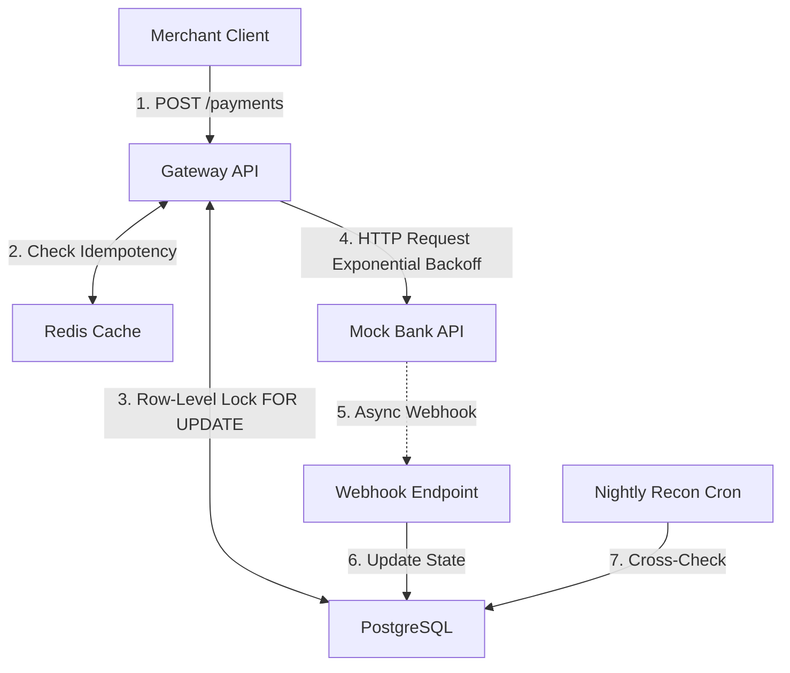
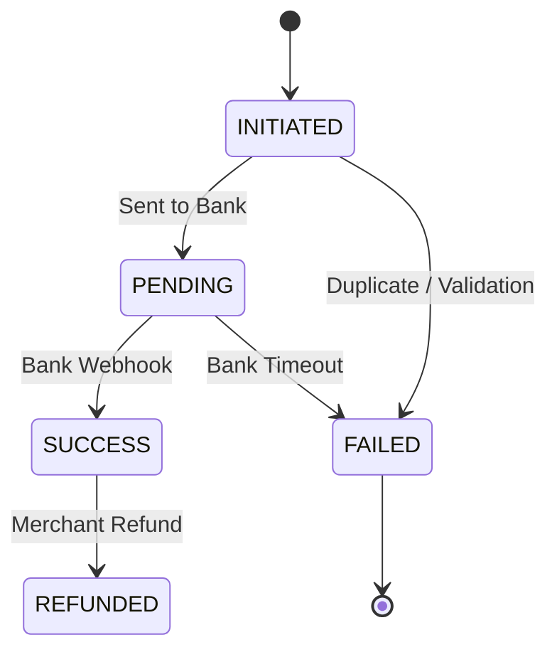

# Payment Gateway Simulator 🚀

A high-concurrency transaction processing simulator demonstrating production-grade FinTech principles. Engineered to showcase how modern payment aggregators (like Stripe, Juspay, or Razorpay) handle distributed system edge cases securely.

## 🏗️ System Architecture



### Transaction State Machine


## 🌟 Core Concepts Implemented

### 1. Strict Idempotency (Preventing Double-Charges)
Implemented a robust idempotency engine using **Redis**. 
- API requests require an `Idempotency-Key` header.
- Cached responses are returned instantly for duplicate requests, protecting downstream systems.
- **Database Fallback:** If the cache layer fails or purposefully bypasses `502` errors (to allow merchant retries), **PostgreSQL Unique Constraints** catch duplicate insertions. The API gracefully queries the database and returns the true terminal state, ensuring the database remains the ultimate source of truth.

### 2. Transaction State Machine
Transactions enforce strict state transitions to prevent corrupted states:
`INITIATED` ➔ `PENDING` ➔ `SUCCESS` / `FAILED`

### 3. Exponential Backoff & Retry Logic
Network calls to the banking layer are inherently unreliable. The mock bank client implements exponential backoff (e.g., waiting 1s, 2s, 4s) before gracefully failing, preventing cascading failures during bank downtimes.

### 4. Concurrency-Safe Webhooks
Banks deliver payment statuses asynchronously via webhooks, which can arrive out-of-order or duplicate.
- Implemented **PostgreSQL Row-Level Locking** (`SELECT ... FOR UPDATE`).
- This absolutely guarantees that if a webhook arrives at the exact millisecond a merchant attempts to cancel a transaction, the database forces sequential execution, preventing race conditions.

### 5. Nightly Reconciliation Job
A simulated background cron job (`npm run recon`) that represents the end-of-day settlement process. It ingests a mock bank statement, cross-checks it against the local database, and automatically issues `UPDATE` queries to correct mismatches (e.g., partial failures where the webhook was dropped but the bank successfully charged the customer).

---

## 🛠️ Tech Stack
- **Backend:** Node.js, Express, TypeScript
- **Database:** PostgreSQL (ACID compliance, Row-Locking)
- **Cache:** Redis (Idempotency, Fast reads)
- **Containerization:** Docker & Docker Compose

---

## 🚀 Running the Project Locally (Docker)

You can spin up the entire architecture (Node.js API, PostgreSQL, and Redis) with a single command using Docker.

### 1. Start the services
```bash
docker-compose up --build -d
```

### 2. Test Idempotency & Bank Fallback
Send a request to create a payment. The mock bank is configured to fail (simulating downtime).
```bash
curl -X POST http://localhost:3000/payments \
  -H "Idempotency-Key: key-123" \
  -H "Content-Type: application/json" \
  -d '{"merchantId":"m_001", "amount":5000, "currency":"USD"}'
```
*Run the exact same command again. Notice that the system catches the duplicate attempt and safely returns the existing `FAILED` state.*

### 3. Test Webhook Concurrency
Send a webhook to forcefully update a transaction:
```bash
curl -X POST http://localhost:3000/webhooks/bank \
  -H "Content-Type: application/json" \
  -d '{"transactionId":"<INSERT_ID_HERE>", "status":"SUCCESS"}'
```
*If the transaction is already in a terminal state, the webhook is safely ignored.*

### 4. Run the Reconciliation Job
```bash
npm run recon
```
